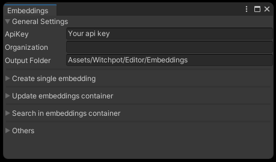

# UnitySoundSearchDemo
This is a system for searching desired audio files in distributed audio files in assets.    
You can search the audio file with ambiguous words or phrases.

This system using OpenAI's [embeddings](https://platform.openai.com/docs/guides/embeddings/what-are-embeddings) feature.

---

## Getting started     
### Sample search
Clone this repository and open the repository with in Unity  
```
git clone git@github.com:witchpot-studio/UnitySoundSearchDemo.git 
```
Will automatically install dependency files   
    
Open Menu > Witchpot > Editor > Embeddings Window     
    

Add your own OpenAI API key and Organization(optional)    
You can generate it in [OpenAI web page](https://platform.openai.com/account/api-keys) (Log in is required)    
> \*Note that the API key is saved in Assets\Witchpot\Editor\Scripts\Parameter.asset. It is set gitignore but be careful to avoid pushing it to git.    


    
We already have search example with free asset [Free Sound Effects Pack](https://assetstore.unity.com/packages/audio/sound-fx/free-sound-effects-pack-155776)    
Please import this asset if you would like to check the actual sound effect.    

Open Menu > Witchpot > Editor > Search Window    


Add search Prompt and push Search button.    
The most related file name will be in search result.    


The search is based on the euclidean distance of embeddings of prompt and each audio files name's embeddings.

---

### Enable search other audio files  
We need to get every audio files name embeddings and register those embeddings in to container(Scriptable Object) to reduce calling embeddings api.    
Hit Create > Witchpot > EmbeddingsContainer in Assets/Witchpot/Editor/Container/    

Enter the created container into the container, enter Include folder(All audio files parent folder) in embeddings window    
    
As example, imported [GDC 2023 - Game Audio Bundle](https://gdc.sonniss.com/) into Assets/GDC/
Hit the Update button to get all embeddings.    
You can search files with using the new container.

## Credits
Thanks to
 - [NuGet importer for Unity](https://github.com/kumaS-nu/NuGet-importer-for-Unity)
 - [UniTask](https://github.com/Cysharp/UniTask)
## License
This repository is under MIT License.     
For more detail please see [LICENSE](./LICENSE.txt)

